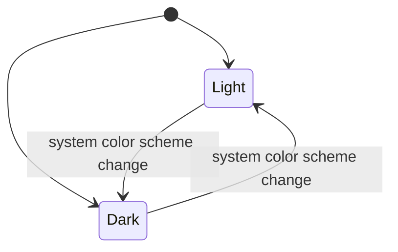

# SaneUI Architecture

Last updated: 2026-02-02

## Purpose

SaneUI is a Swift Package that provides shared visual primitives for Sane apps: backgrounds, colors, and icon constants.

## System Context

- **Swift Package** (`Package.swift`) consumed by macOS apps.
- **No runtime services** or persistence.
- **Pure SwiftUI components** and constants.

## Core Components

| Component | Responsibility | Key Files |
|---|---|---|
| SaneGradientBackground | Glass-like adaptive background | `Sources/SaneUI/Backgrounds.swift` |
| VisualEffectBlur | NSVisualEffectView wrapper | `Sources/SaneUI/Backgrounds.swift` |
| GlassGroupBoxStyle | GroupBox glass style | `Sources/SaneUI/Backgrounds.swift` |
| SaneColors | Semantic color palette | `Sources/SaneUI/Colors.swift` |
| AdaptiveColors | Light/dark adaptive tokens | `Sources/SaneUI/Colors.swift` |
| SaneIcons | SF Symbol constants | `Sources/SaneUI/Icons.swift` |

## Data and Persistence

None. SaneUI provides view components and constants only.

## State Machines

### Color Scheme Adaptation

| State | Meaning | Entry | Exit |
|---|---|---|---|
| Light | Light mode colors/materials | system light scheme | scheme change |
| Dark | Dark mode colors/materials | system dark scheme | scheme change |

## Build and Release Truth

- **Build**: `swift build`
- **Test**: `swift test`
- **Distribution**: Swift Package (local path or GitHub)

## Testing Strategy

- Unit tests live in `Tests/SaneUITests/`.

## Risks and Tradeoffs

- Visual consistency depends on apps adopting these primitives.
- Changes affect all consuming apps; versioning must be handled carefully.
