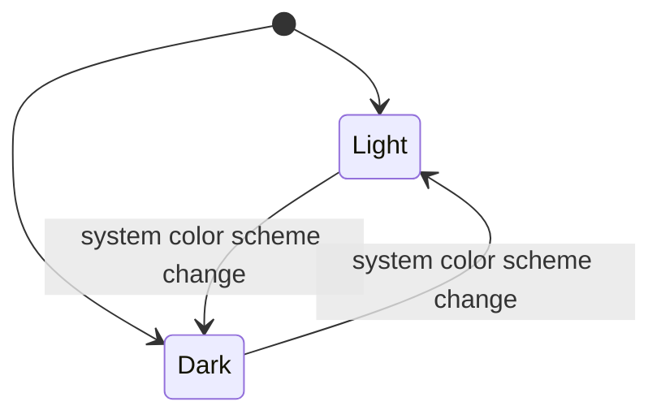

# SaneUI Architecture

Last updated: 2026-05-09

## Purpose

SaneUI is a Swift Package that provides the shared source of truth for SaneApps UI. It now covers:

- visual primitives: backgrounds, colors, icons
- shared settings shell: tabs, sections, rows, toggles
- shared settings surfaces: About, license, updater, feedback, permissions
- shared behavior helpers: standard menus, launch-at-login, app storage, move-to-Applications, update eligibility
- a standalone visual catalog used to inspect the current design system

## System Context

- **Swift Package** (`Package.swift`) consumed by macOS apps.
- **Mostly view-driven** SwiftUI components and constants.
- **Small shared service helpers** for app storage, Keychain-backed license state, login items, diagnostics, and direct-download install/update eligibility.
- **No app-specific business logic**: consuming apps provide product identity, license/update adapters, diagnostics, and channel policy.

## Core Components

| Component | Responsibility | Key Files |
|---|---|---|
| SaneGradientBackground | Glass-like adaptive background, static by default with opt-in animation | `Sources/SaneUI/Backgrounds.swift` |
| VisualEffectBlur | NSVisualEffectView wrapper | `Sources/SaneUI/Backgrounds.swift` |
| GlassGroupBoxStyle | GroupBox glass style | `Sources/SaneUI/Backgrounds.swift` |
| SaneColors | Semantic color palette | `Sources/SaneUI/Colors.swift` |
| AdaptiveColors | Light/dark adaptive tokens | `Sources/SaneUI/Colors.swift` |
| SaneIcons | SF Symbol constants | `Sources/SaneUI/Icons.swift` |
| SaneSettingsContainer | Shared settings tab shell | `Sources/SaneUI/Components/SaneSettingsContainer.swift` |
| CompactSection / CompactRow | Shared settings layout primitives | `Sources/SaneUI/Components/Section.swift`, `Sources/SaneUI/Components/Row.swift` |
| SaneAboutView | Shared About/support surface | `Sources/SaneUI/Components/SaneAboutView.swift` |
| SaneAboutLicenseCatalog | Shared About/license catalog data | `Sources/SaneUI/Components/SaneAboutLicenseCatalog.swift` |
| LicenseSettingsView | Shared license surface | `Sources/SaneUI/License/LicenseSettingsView.swift` |
| KeychainService | Shared license Keychain storage | `Sources/SaneUI/License/KeychainService.swift` |
| SaneSparkleRow | Shared direct-update surface | `Sources/SaneUI/Components/SaneSparkleRow.swift` |
| SaneUpdateEligibility | Shared update/move-to-Applications eligibility | `Sources/SaneUI/Components/SaneUpdateEligibility.swift` |
| SaneApplicationMover | Shared copy-to-Applications flow | `Sources/SaneUI/Components/SaneApplicationMover.swift` |
| SaneStandardMenu | Shared status-bar/Dock utility menu contract | `Sources/SaneUI/Components/SaneStandardMenu.swift` |
| SaneLoginItemToggle | Shared launch-at-login control | `Sources/SaneUI/Components/SaneLoginItemToggle.swift` |
| SanePermissionGuidanceView | Shared permission explanation/recovery row | `Sources/SaneUI/Components/SanePermissionGuidanceView.swift` |
| SaneFeedbackView | Shared diagnostics-backed bug report surface | `Sources/SaneUI/Components/SaneFeedbackView.swift` |
| SaneAppStorage | Shared app-owned storage helper | `Sources/SaneUI/Components/SaneAppStorage.swift` |
| SaneUICatalog | Standalone visual source-of-truth app | `Sources/SaneUICatalog/SaneUICatalogApp.swift` |

Channel invariant: shared About/license/update surfaces must be channel-aware. App Store consumers cannot inherit direct-download purchase, donation, GitHub Sponsors, crypto, Sparkle, or direct license-key paths through SaneUI defaults.

## Data and Persistence

SaneUI stays mostly view-driven. It has light app-facing state only where shared surfaces need it, such as:

- license state via `LicenseService`
- license key persistence via `KeychainService`
- updater preferences via `SaneSparkleRow`
- diagnostics export via `SaneDiagnosticsService`
- app-owned file locations via `SaneAppStorage`
- launch-at-login state via `SaneLoginItemToggle`

## State Machines

### Color Scheme Adaptation

```mermaid
stateDiagram-v2
  [*] --> Light
  [*] --> Dark
  Light --> Dark: system color scheme change
  Dark --> Light: system color scheme change
```

| State | Meaning | Entry | Exit |
|---|---|---|---|
| Light | Light mode colors/materials | system light scheme | scheme change |
| Dark | Dark mode colors/materials | system dark scheme | scheme change |

## Build and Release Truth

- **Build**: `swift build`
- **Test**: `swift test`
- **Distribution**: Swift Package (local path or GitHub)
- **Visual inspection**: `swift run SaneUICatalog`

## Testing Strategy

- Unit tests live in `Tests/SaneUITests/`.

## Risks and Tradeoffs

- Visual consistency still depends on app repos actually adopting shared surfaces.
- Changes affect all consuming apps; versioning must be handled carefully.
- If app repos redefine shared settings surfaces locally, design drift returns. The intended mitigation is to extend SaneUI, inspect the catalog first, and let SaneProcess drift checks block known clone patterns.
